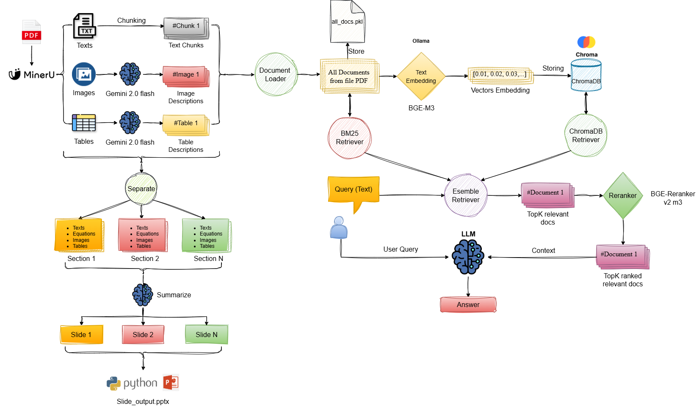
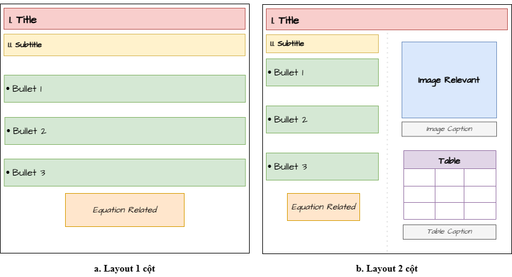
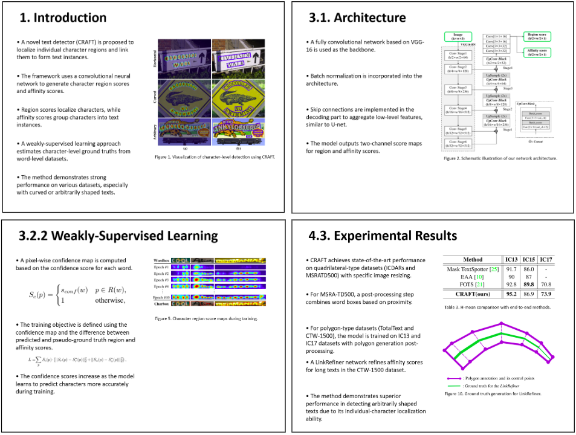

# PDF to Slide Generator

A powerful tool that converts academic PDF papers into presentation slides with AI-powered summarization and visualization.

## System Overview

The system follows a comprehensive pipeline to transform PDF papers into well-structured presentation slides:



## Features

- PDF processing and content extraction
- AI-powered content summarization using Gemini
- Automatic slide generation with proper formatting
- Interactive chat interface for querying paper content
- Support for equations, tables, and figures
- Smart content organization and layout

## Slide Layout

The generated slides follow a consistent and professional layout structure:



## Example Output

Here's an example of a generated slide:



## Installation

1. Clone the repository:
```bash
git clone https://github.com/yourusername/pdf-to-slide-generator.git
cd pdf-to-slide-generator
```

2. Install dependencies:
```bash
pip install -r requirements.txt
```

3. Set up environment variables:
Create a `.env` file in the root directory with:
```
GEMINI_API_KEY=your_gemini_api_key
```

## Usage

### Running the Gradio Interface

```bash
python src/api/gradio_app.py
```

This will start the web interface at `http://localhost:7860`

### Using as a Python Package

```python
from src.slide_generator import create_slide
from src.data_processing import process_pdf

# Process PDF and generate slides
pdf_path = "path/to/your/paper.pdf"
create_slide(pdf_path)
```

## Project Structure

```
project_name/
│
├── notebooks/               # Original & exploratory notebooks
│   └── thesis.ipynb
│
├── src/                     # Core Python code
│   ├── __init__.py
│   ├── main.py             # Pipeline entry point
│   ├── utils.py            # Utility functions
│   ├── data_processing.py  # PDF processing
│   ├── slide_generator.py  # Slide generation
│   └── api/                # Gradio interface
│
├── assets/                 # Sample files and images                
└── tests/                  # Unit tests
```

## Contributing

1. Fork the repository
2. Create your feature branch
3. Commit your changes
4. Push to the branch
5. Create a Pull Request

## License

This project is licensed under the MIT License - see the LICENSE file for details. 
=======
# SoICT-PDF-RAG-Slide-Gen
RAG-based tool to retrieve, generate, and auto-create slides from scanned PDF files
>>>>>>> ac2db5bef032234b0dda56f2350419fc1f4976e8
